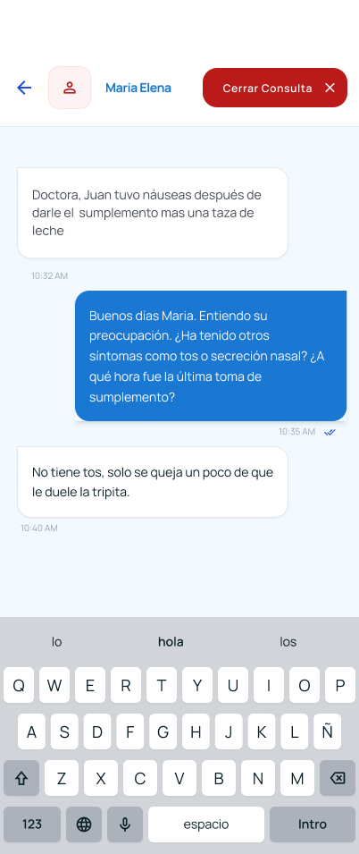
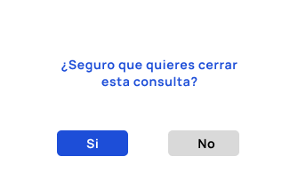
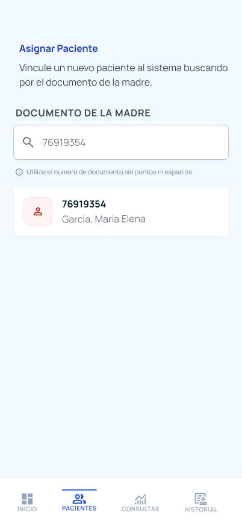

### Ariana

#### Seccion de Comunicacion + Chat

> se redirecciona a este frame cuando seleciona en el nav inferior la opcion de consultas

<div align="center">
    
</div>


> el chat se abre cuando seleciono un card de la bandeja de consultas

<div align="center">
    
</div>

> Modal para decidir si el enfermero quiere cerrar una consulta (ocurre al momento de presionar el btn de cerrar)

<div align ="center">

</div>


#### Frame sin Consultas

> caso de que el enfermero no tiene una consulta de las madres de un paciente en la bandeja de consultas

<div align ="center">

</div>

#### Frame de Sin Pacientes

> caso de que el enfermero no tiene enfermeros en su cartera

<div align ="center">

</div>

#### Frame Sin Resultados de Busqueda

<div align ="center">

</div>


Conectar los siguientes **Endpoints**:


- **GET /communication/consultations/nurse?searchTerm=**

**Escenario 1: Con consultas activas**

```json
[
    {
        "consultationId": "string",
        "patientId": "string",
        "patientName": "Mateo Pérez",
        "motherId": "string",
        "motherName": "Ana Pérez",
        "nurseId": "string",
        "nurseName": "María González",
        "lastMessage": "Gracias enfermera, aplicaré la indicación...",
        "lastMessageDate": "2024-01-15T10:30:00.000Z",
        "createdAt": "2024-01-15T10:00:00.000Z",
        "messageCount": 5
    },
    {
        "consultationId": "string",
        "patientId": "string",
        "patientName": "Valentina Gómez",
        "motherId": "string",
        "motherName": "María Gómez",
        "nurseId": "string",
        "nurseName": "María González",
        "lastMessage": "Mi hija tiene fiebre...",
        "lastMessageDate": "2024-01-15T11:00:00.000Z",
        "createdAt": "2024-01-15T10:30:00.000Z",
        "messageCount": 3
    }
]
```

**Escenario 2: Tiene pacientes asignados pero NO tiene consultas activas** -> Mostrar frame de Sin Consultas

```json
{
    "consultations": [],
    "message": "No tienes consultas activas aún",
    "detail": "Las madres pueden iniciar consultas para sus hijos. Cuando una madre inicie una consulta, aparecerá aquí.",
    "status": "NO_CONSULTAS"
}
```

**Escenario 3: NO tiene pacientes asignados en su cartera** -> Mostrar Frame de Sin Pacientes

```json
{
    "consultations": [],
    "message": "No tienes pacientes asignados en tu cartera",
    "detail": "Puedes asignar pacientes a tu cartera desde el módulo de pacientes. Ve a 'Pacientes' y selecciona 'Asignar a mi cartera'.",
    "action": "Asignar pacientes",
    "status": "SIN_PACIENTES"
}
```

**Escenario 4: Búsqueda sin resultados** -> Mostrar Frame de Sin resultados de busqueda

```json
{
    "consultations": [],
    "message": "No se encontraron consultas que coincidan con tu búsqueda",
    "detail": "No hay consultas con \"Carlos\" en el nombre del paciente o de la madre. Intenta con otro término.",
    "searchTerm": "Carlos",
    "status": "BUSQUEDA_SIN_RESULTADOS"
}
```

> Ver mas: [Link](https://github.com/SANUVI-MINSA/backend-ferova/blob/deployment-test/src/context/comunication-management/Documentacion.md#8-obtener-consultas-activas-de-una-enfermera-bandeja-de-consultas)


- **POST /messages**

Envía un mensaje dentro de una teleconsulta activa.


```json
{
    "consultationId": "string",
    "senderId": "string",
    "senderRole": "MOTHER | NURSE",
    "content": "string"
}
```
> Ver mas: [Link](https://github.com/SANUVI-MINSA/backend-ferova/blob/develop/src/context/comunication-management/Documentacion.md#2-enviar-mensaje-madre-o-enfermera)


- **GET /chat/:consultationId**

Abri chat cuando seleciono una consulta desde la bandeja de consultas

```json
{
    "consultationId": "string",
    "patientId": "string",
    "nurseId": "string",
    "messages": [
        {
            "id": "string",
            "senderId": "string",
            "senderRole": "MOTHER | NURSE",
            "content": "string",
            "sentAt": "2024-01-15T10:30:00.000Z"
        }
    ]
}
```

> Ver mas: [Link](https://github.com/SANUVI-MINSA/backend-ferova/blob/develop/src/context/comunication-management/Documentacion.md#6-obtener-chat-de-consulta-madre-o-enfermera)


### Seccion Pacientes

Busqueda de la madre por dni


<div align="center">

</div>

### Pacientes de la Madre

<div align="center">

</div>


<div align="center">

</div>

### Caso que la madre no tenga pacientes

<div align="center">

</div>

### Caso que cuando presiona el btn de presionar (asignar a mi cartera a un paciente) y dicho enfermero que lo ejecuta no tiene una posta assignada en ella.

<div align="center">

</div>

Conectar los siguientes **Endpoints**:


- **GET /mother/search/{dni}**

```json
{
  "motherId": "550e8400-...",
  "fullName": "Diana Carrillo",
  "dni": "12345678"
}
```
> Ver mas [Link](https://github.com/SANUVI-MINSA/backend-ferova/blob/develop/src/context/patient-management/Documentation.md#get-mothersearchdni--buscar-madre-por-dni)

- **GET /mother/{motherId}**

```json
[
  {
    "patientId": "660e8400-...",
    "patientName": "Mateo",
    "patientLastName": "Perez",
    "gender": "MALE",
    "status": "ACTIVE",
    "statusAssignment": "ASSIGNED"
  },
  {
    "patientId": "660e8400-...",
    "patientName": "Valentina",
    "patientLastName": "Gomez",
    "gender": "FEMALE",
    "status": "ACTIVE",
    "statusAssignment": "UNASSIGNED"
  }
]
```

caso de que la madre no registro un paciente

```json
  []
```

---
> Ver mas [Link](https://github.com/SANUVI-MINSA/backend-ferova/blob/develop/src/context/patient-management/Documentation.md#get-mothermotherid--listar-pacientes-por-madre)


- **POST /assign-nurse**


**Request body:**

```json
{ "patientId": "660e8400-e29b-41d4-a716-446655440001" }

```

**Response 200 Ok**

```json
{ "message": "Patient assigned successfully" }
```

**Error 404**

```json
{ "message": "Nurse is not assigned to any facility" }
```


> Ver mas [Link](https://github.com/SANUVI-MINSA/backend-ferova/blob/develop/src/context/patient-management/Documentation.md#post-assign-nurse--asignarse-un-paciente)

# Flujos

## Comunication + Chat

### Scenario 1: Enfermero tiene pacientes asignados sin consultas activas de las madres

<div align="center">

</div>

Desde Home cuando accedo a la opcion de consultas, se redirecciona a la bandeja de consultas, donde se listan las consultas activas de las madres. Si no hay consultas activas, se muestra un frame de Sin Consultas.

### Scenario 2: Enfermero no tiene pacientes asignados en su cartera

<div align="center">

</div>

Desde Home cuando accedo a la opcion de consultas, se redirecciona a la bandeja de consultas, donde se listan las consultas activas de las madres. Si no hay pacientes asignados en su cartera, se muestra un frame de Sin Pacientes.
Y se muestra un boton para asignar pacientes el cual redirecciona a la seccion de pacientes, donde se puede buscar a la madre por dni y asignar a su paciente a la cartera del enfermero.

### Scenario 3: Enferemro tiene consultas activas y busca consultas por nombre de paciente o madre

<div align="center">

</div>

Desde Home cuando accedo a la opcion de consultas, se redirecciona a la bandeja de consultas, donde se listan las consultas activas de las madres. Si el enfermero realiza una busqueda por nombre de paciente o madre y no hay resultados, se muestra un frame de Sin resultados de busqueda.
Caso contrario, se muestran las consultas que coinciden con el termino de busqueda.

### Scenario 4: Enfermero tiene consultas activas y abre el chat de la consulta selecionada, envia un mensaje y cierra la consulta

<div align="center">

</div>

Desde Home cuando accedo a la opcion de consultas, se redirecciona a la bandeja de consultas, donde se listan las consultas activas de las madres. Si el enfermero selecciona una consulta de la bandeja le abrira el chat con la madre el cual podra enviarle un mensaje y cerrar dicha consulta si todo las dudas de la madre se aclaren.
Dicha Consulta cerrada actualizada la bandeja de consulta el cual dicha consulta cerrada se elimina de la bandeja de consultas.

## Asignacion de pacientes a la cartera del enfemero (Seccion Pacientes)

### Scenario 1: Si la madre encontrada por el dni no tiene pacientes registrados desde FerovaFamily

<div align="center">

</div>

Desde Home cuando accedo a la opcion de pacientes, se redirreciona a un buscador en el cual introducimos el dni de la madre, para assignar a un paciente que ella registro desde Ferova Family.
Pero Caso de que no registro un paciente la madre desde FerovaFamily, aparecera un frame de no se encontraro niños registrados,

### Scenario 2: Si el enfemero no tiene una posta assignada por parte del admin

<div align="center">

</div>

Desde Home cuando accedo a la opcion de pacientes, se redirreciona a un buscador en el cual introduzco el dni de la madre, para asignar a un paciente que dicha madre registro desde ferovafamily.
Una vez introducido el dni y selecionar a la madre de la busqueda, se mostraran los pacientes que registro dicha madre, una vez que el enfermero quiere asignar dicho paciente a su cartera se mostrara un mensaje de modal de **Nurse is not assigned to any facilty**, el cual representa de que el enfermero no tiene una posta asignada por parte del admin y no podra asignar a su cartera a dicho paciente seleccionado.

### Scenario 3: Si el enfemero tiene una posta assignada por parte del admin entonces podra assingar a su carter a un paciente

<div align="center">

</div>

Desde Home cuando accedo a la opcion de pacientes se redirreciona a un buscador en el cual introducimos el dni de la madre, para assignar a un paciente que dicha madre registro desde ferovafamily.
Una vez introducido el dni y seleccionar a la madre de la busqueda, se mostraran los pacientes que registro dicha madre, una vez que el enfermero quiera asignar dicho paciente a su cartera presiona le btn de assignar cambiara el estado del card pasando de **Sin asignar -> Asignado**.

> Ari si es posible haz una animacion al momento de presionar el btn de assignar paciente en si seria bueno la verdad intentalo es un reto (Dyaron lo hizo en si recuerdo bien en Flutter, habla con el de ello).