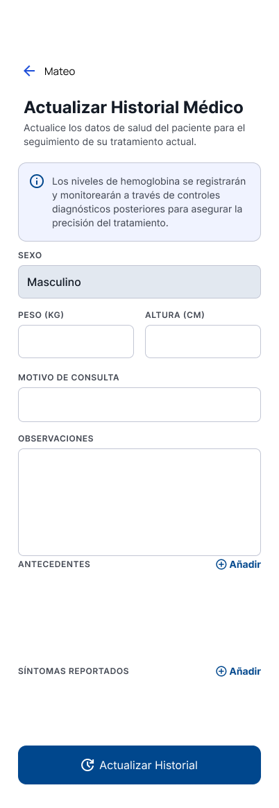
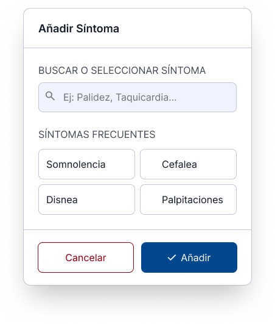

### Dyron

#### Seccion de Historial - Añadir Control de Hemoglobina

> Mira en la seccion de historial se obtiene una lista de pacientes asignados a la cartera por parte del enfermero que
> lo fue asignado en la seccion pacientes (que lo esta haciendo ariana)

> Seccion de Historial de medico con btn de ver y actualizar
> estos btn se habilitan cuando ya se registo un historial medico por parte del enfermero a un paciente. 

> Frame sin pacientes asignados
> Se muestra en la seccion de historial medico el cual se mostrar si el enfermo no asigno a un paciente a su cartera

> Frame de actualizar
> Se muestra el frame de actualizar un historial medico, por parte del enfermero el cual se seleciona por el btn de actualizar de un card de la lista de pacientes en la seccion de historial medico.

> Registrar Historial medico del paciente selecionado de la lista pacientes asignados a la cartera por parte del enfermero

> Modal para el registo de Antecedentes
> Este modal es para registrar 

> Modal Para el registro de sintomas
> Este modal es para registrar sintomas en el historial medico

> Frame de Historial medico creado por primera vez
> (Si es creado por primera vez no tiene registro de controles de hemoglobina el cual se da presencia de dicho btn en si)

> Frame de Control de Hemoglobina
> Primer frame de lista de pacientes asignados a la cartera del paciente en el contro de hemoglobina para selecionar el paciente y registrar el contro de hemoglobina

> Frame de Falta de Historial medico
> al momento de selecionar al paciente de la lista de contro de hemoglobina (que es la lista de pacientes que estan en la cartera del enfermero),
> si uno no tiene un historial medico no se le podra registrar el contro de hemoglobina

> Frame de Nuevo Control o Registo de Control de hemoglobina
> Aca una vez de que el paciente tenga un historial medico, se permitira a registra el control de hemoglobina y no se mostrara el frame de falta historial medico

> una vez registrado la hemoglobina ya se por primera vez desde el historial medico o en la seccion home en accesos rapidos en el btn de **registrar control**
> se vera el ultimo registro de hemoglobina reciente en si en el card de hemoglobina el cual tambien desaperece el btn de realizar primer control, por que ya se registro el primer control.
> se ver el btn de descargar el cual permite descargar el historial medico en pdf

> Historial de Control de Hemoglobina
> En este frame se ve el historial de controles de hemoglobina, viendo el promedio, la evolucion en si datos calculados del backend,
> esta el btn de descargar el cual tambien descargar el historial de control de hemoglobina, tambien esta el btn de añadir un nuevo control
> el cual nos redireciona al frame de Nuevo Control o Registo de Control de hemoglobina, el cual registramos un nuevo control de hemoglobina en si.

> Historial de contol de hemoglobina
> Muestra de otros historiales registrados

