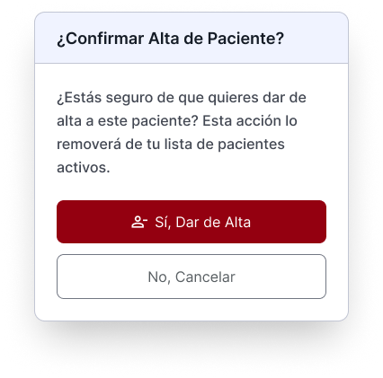

# Dar de Alta — Documentación de Feature

## Imágenes de Referencia

### Frame de dar de alta

<div align="center">

</div>

### Frame de que no hay pacientes para dar de alta

<div align="center">

</div>

### Frame resultados buscador

<div align="center">

</div>

### Frame modal de confirmación

<div align="center">

</div>

---

## Escenarios

### 1. Dar de alta a un paciente

Al tocar el botón **Dar de alta**, se muestra la lista de pacientes disponibles para ser dados de alta. Al seleccionar uno, aparece un **modal de confirmación** con dos opciones:

- **Cancelar** → cierra el modal, sin cambios.
- **Confirmar alta** → el paciente desaparece de la lista.

<div align="center">

</div>

### 2. Sin pacientes para dar de alta

Si el endpoint retorna una lista vacía, se muestra el frame de estado vacío junto con un botón **Asignar paciente** que redirige a la sección de Pacientes (a cargo de Ariana).

<div align="center">

</div>

### 3. Búsqueda de pacientes

El buscador filtra la lista en tiempo real:

- **Con resultados** → se muestran los pacientes que coinciden.
- **Sin resultados** → se muestra un frame con el mensaje: _"No se encontraron resultados para '[término]'"_ (frame a diseñar por el dev).

<div align="center">

</div>

---

## Endpoints

### `GET /discharge/nurse` — Listar pacientes disponibles para alta

Lista los pacientes activos asignados a la enfermera que pueden ser dados de alta.

**Headers:**
```http
Authorization: Bearer <token>
```

**Query params:**

| Parámetro | Tipo | Requerido | Descripción |
|---|---|---|---|
| `searchTerm` | string | ❌ | Filtra por nombre o apellido (coincidencia parcial) |

---

#### Respuestas por status

| Status | Significado | Cuándo ocurre |
|---|---|---|
| `SUCCESS` | Lista cargada con pacientes | Hay pacientes elegibles, sin búsqueda activa |
| `EMPTY` | Lista vacía | No hay pacientes elegibles para alta |
| `SEARCH_SUCCESS` | Búsqueda con resultados | La búsqueda encontró coincidencias |
| `SEARCH_EMPTY` | Búsqueda sin resultados | La búsqueda no encontró coincidencias |

---

#### Escenario A: Pacientes disponibles (`SUCCESS`)

**Request:**
```http
GET /api/patients/discharge/nurse
Authorization: Bearer <token>
```

**Response `200 OK`:**
```json
{
  "success": true,
  "status": "SUCCESS",
  "message": "Pacientes elegibles para alta recuperados exitosamente",
  "data": {
    "patients": [
      {
        "id": "660e8400-e29b-41d4-a716-446655440001",
        "name": "Mateo",
        "lastName": "Perez",
        "gender": "MALE",
        "status": "ACTIVE",
        "nurseId": "770e8400-e29b-41d4-a716-446655440000",
        "motherId": "550e8400-e29b-41d4-a716-446655440000",
        "birthDate": "2023-05-10T00:00:00.000Z",
        "facilityId": "33e8ab63-2875-41b5-91f1-ac9a37d1ddc6"
      },
      {
        "id": "8ad97c1d-7a3c-4101-b086-8551b0a85f6a",
        "name": "Daniel",
        "lastName": "Baca",
        "gender": "MALE",
        "status": "ACTIVE",
        "nurseId": "770e8400-e29b-41d4-a716-446655440000",
        "motherId": "550e8400-e29b-41d4-a716-446655440001",
        "birthDate": "2023-06-15T00:00:00.000Z",
        "facilityId": "33e8ab63-2875-41b5-91f1-ac9a37d1ddc6"
      }
    ],
    "total": 2,
    "nurseId": "770e8400-e29b-41d4-a716-446655440000"
  }
}
```

> **UI:** Mostrar la lista de pacientes elegibles.

---

#### Escenario B: Sin pacientes disponibles (`EMPTY`)

**Request:**
```http
GET /api/patients/discharge/nurse
Authorization: Bearer <token>
```

**Response `200 OK`:**
```json
{
  "success": true,
  "status": "EMPTY",
  "message": "No hay pacientes elegibles para alta en este momento",
  "data": {
    "patients": [],
    "total": 0,
    "nurseId": "770e8400-e29b-41d4-a716-446655440000"
  }
}
```

> **UI:** Mostrar el frame de estado vacío con el botón **Asignar paciente** que redirige a la sección de Pacientes.

```
┌─────────────────────────────────────────┐
│  🏥 Sin pacientes para alta             │
│                                         │
│  No hay pacientes elegibles para dar    │
│  de alta en este momento.               │
│                                         │
│  [➕ Asignar paciente]                  │
└─────────────────────────────────────────┘
```

---

#### Escenario C: Búsqueda con resultados (`SEARCH_SUCCESS`)

**Request:**
```http
GET /api/patients/discharge/nurse?searchTerm=Carlos
Authorization: Bearer <token>
```

**Response `200 OK`:**
```json
{
  "success": true,
  "status": "SEARCH_SUCCESS",
  "message": "Se encontraron 1 paciente(s) elegibles para alta que coinciden con \"Carlos\"",
  "data": {
    "patients": [
      {
        "id": "660e8400-e29b-41d4-a716-446655440001",
        "name": "Carlos",
        "lastName": "Lopez",
        "gender": "MALE",
        "status": "ACTIVE",
        "nurseId": "770e8400-e29b-41d4-a716-446655440000",
        "motherId": "550e8400-e29b-41d4-a716-446655440000",
        "birthDate": "2023-05-10T00:00:00.000Z",
        "facilityId": "33e8ab63-2875-41b5-91f1-ac9a37d1ddc6"
      }
    ],
    "total": 1,
    "searchTerm": "Carlos",
    "nurseId": "770e8400-e29b-41d4-a716-446655440000"
  }
}
```

> **UI:** Mostrar los pacientes encontrados en la lista.

---

#### Escenario D: Búsqueda sin resultados (`SEARCH_EMPTY`)

**Request:**
```http
GET /api/patients/discharge/nurse?searchTerm=Ana
Authorization: Bearer <token>
```

**Response `200 OK`:**
```json
{
  "success": true,
  "status": "SEARCH_EMPTY",
  "message": "No se encontraron pacientes elegibles para alta que coincidan con \"Ana\"",
  "data": {
    "patients": [],
    "total": 0,
    "searchTerm": "Ana",
    "nurseId": "770e8400-e29b-41d4-a716-446655440000"
  }
}
```

> **UI:** Mostrar frame de sin resultados (a diseñar). Incluir el término buscado en el mensaje.

```
┌─────────────────────────────────────────┐
│  🔍 No se encontraron resultados        │
│                                         │
│  No hay pacientes elegibles para alta   │
│  que coincidan con "Ana".               │
└─────────────────────────────────────────┘
```

---

#### Errores `400`

| Error | Causa |
|---|---|
| `Nurse ID no encontrado en el token` | Token inválido o sin claim `nurseId` |

---

### `PUT /discharge` — Dar de alta a un paciente

Se llama al confirmar el alta desde el modal de confirmación. Si el alta es exitosa, el paciente se elimina de la lista (refrescar con `GET /discharge/nurse`).

**Reglas de negocio:**
- Solo la enfermera asignada al paciente puede dar el alta.
- El `nurseId` se extrae automáticamente del token.

**Headers:**
```http
Authorization: Bearer <token>
Content-Type: application/json
```

**Request body:**
```json
{
  "patientId": "660e8400-e29b-41d4-a716-446655440001"
}
```

**Response `200 OK`:**
```json
{
  "message": "Patient discharged successfully"
}
```

**Errores `400`:**

| Error | Causa |
|---|---|
| `Patient not found` | El paciente no existe |
| `Only assigned nurse can discharge patient` | La enfermera no está asignada a este paciente |